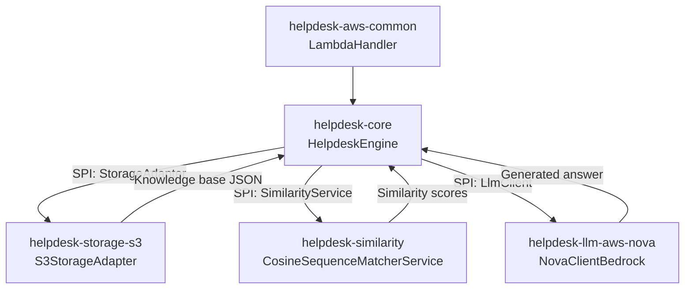

# Helpdesk Backend

## Overview
This repository hosts a modular Java 17 helpdesk backend built with Maven. The core engine orchestrates knowledge-base retrieval, similarity scoring, and LLM completion behind provider-specific modules that can be packaged for AWS Lambda or other runtimes. Each module publishes its SPI implementation through `META-INF/services`, keeping the runtime pluggable.

## Architecture Snapshot
`helpdesk-core` packages `HelpdeskEngine`, domain models, and the SPI loader. Provider modules (`helpdesk-similarity`, `helpdesk-storage-s3`, `helpdesk-llm-aws-nova`) implement the similarity, storage, and LLM contracts, while `helpdesk-aws-common` offers the Lambda harness plus Bedrock utilities.

## Component Diagram

## Modules
- [`helpdesk-core`](helpdesk-core/README.md)
- [`helpdesk-similarity`](helpdesk-similarity/README.md)
- [`helpdesk-storage-s3`](helpdesk-storage-s3/README.md)
- [`helpdesk-llm-aws-nova`](helpdesk-llm-aws-nova/README.md)
- [`helpdesk-aws-common`](helpdesk-aws-common/README.md)

## Public APIs
- `HelpdeskRequest` / `HelpdeskResponse`: JSON-friendly DTOs defining the inbound/outbound contract.
- `StorageAdapter`: SPI for loading `IKnowledge` lists; configured via `storage.*` keys.
- `SimilarityService`: SPI producing `KnowledgeBestMatch` and `topK` collections.
- `LlmClient`: SPI invoked by `HelpdeskEngine` for provider-specific completions.

## Configuration
Set `APP_CONFIG_PATH` so `AppState` can load the YAML in `config/layer/.../helpdesk-config.yaml`. Use `ALWAYS_CALL_LLM` (`true|false`) to force LLM invocation when needed. Provider settings live under `llm.*`, `similarity.*`, and `storage.*` keys.

## Setup
1. Install JDK 17 and Maven 3.9+.
2. Export `APP_CONFIG_PATH` to the desired YAML (for example `config/layer/config/helpdesk-config.yaml`).
3. Ensure AWS credentials are available for modules that hit Bedrock or S3.

## Build & Test
- `mvn clean install` — builds `helpdesk-core` and `helpdesk-similarity`.
- `mvn -PawsNova clean package` — adds AWS Nova LLM, S3 storage, and Lambda harness.
- `mvn -pl helpdesk-core -am test` — fast feedback on the engine and shared models.
- `mvn verify -PawsNova` — end-to-end verification for the Nova bundle.

## Deploy to AWS Lambda
1. Build the shaded jar: `mvn -PawsNova -pl helpdesk-aws-common -am package`.
2. Create the zip: `cd helpdesk-aws-common/target && zip lambda.zip helpdesk-aws-common-*.jar` (replace the glob if you rename the artifact).
3. Upload the zip to Lambda with handler `cloud.contoterzi.aws.common.LambdaHandler::handleRequest`.
4. Alternatively, build a container image:
   - `mvn -PawsNova clean package`
   - `docker build -t your-repo/helpdesk-nova -f Dockerfile .`
   - `docker push` and deploy using Lambda container image support.

## Build Profiles
`awsNova` pulls the Nova LLM plus S3 and Lambda modules; `awsClaude`, `azure`, `ibm`, and `ollama` swap in alternative providers; `all` builds everything for CI.

## Extension Points
Implement new `StorageAdapter` or `SimilarityService` classes, register them under `META-INF/services`, and activate via YAML (`storage.type`, `similarity.type`). Additional LLMs subclass `AbstractLlmClient` (or `AbstractBedrockDriver`) and expose a new `llm.type` id.
